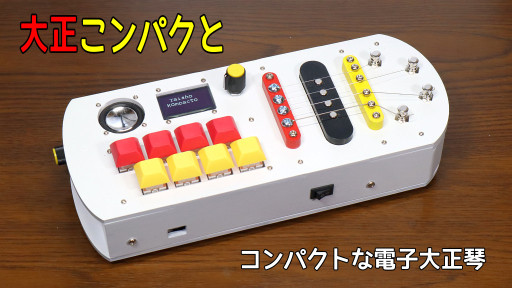
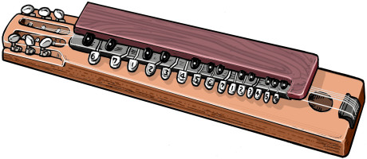

# 大正こンパクと
コンパクトな新しい電子大正琴

## 動画

## コンセプト
大正琴は大正時代に考案された楽器で、左手で鍵盤を押さえ、右手のピックで弦を弾いて演奏するのが特徴です。現在では、アンプで音を増幅する電気大正琴や、シンセサイザーでさまざまな音色を出せる電子大正琴も存在します。

　

「大正こンパクと」は省スペースを追求した新しい電子大正琴です。一般的な大正琴には26個前後のキーがありますが、「大正こンパクと」はたった8個のキーと4本の弦の組み合わせで2オクターブ以上の音域をカバーします。このため横幅25cmと、一般的な大正琴の3分の1ほどのサイズになります。

## 概要
- 弦の振動をエレキギター用ピックアップで検出。
- 8個のキーと4本の鍵盤で2オクターブ以上の音域をカバー。
- SFZ形式のサンプリング音源で琴の音色を再現。

## 構成

- SPRESENSEメインボード および 拡張ボード
- ソフトはPlatformIOで開発 (Arduinoベース)
- ピックアップ (4弦エレキギター用)
- スピーカ
- メカニカルキースイッチ : Cherry MXスイッチ (赤軸)
- エレキギターの弦 : D'Addario EXL110
- マイクロSDカード
- DC/DCコンバータ イーター電機工業 AS6R0-0505 

## 筐体設計
- Autodesk Fusion で設計
- MDF (4mm厚) をレーザー加工 
- [データはこちら](mech/)

## 詳しい解説
[大正こンパクと (コンパクトな新しい電子大正琴) by lipoyang | elchika](https://elchika.com/article/6b575aa8-6e87-465e-a23a-7378933b20f7/)
