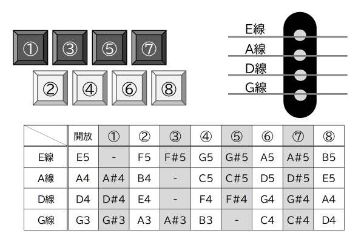
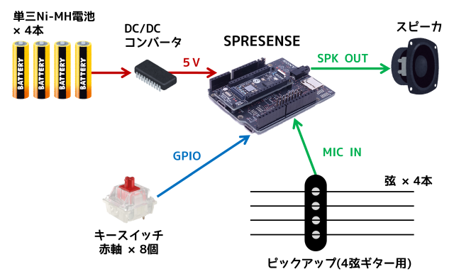
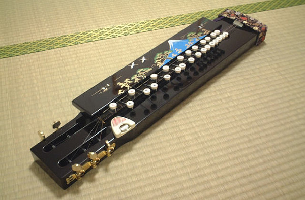

# 大正こンパクと
省スペースを追求した新しい電子大正琴

## 概要
- 弦の振動をエレキギター用ピックアップで検出。
- 8個のキーと4本の鍵盤で2オクターブ以上の音域をカバー。
- SFZ形式のサンプリング音源で琴の音色を再現。

## 構成

- SPRESENSEメインボード および 拡張ボード
- ソフトはPlatformIOで開発 (Arduinoベース)
- ピックアップ (4弦エレキギター用)
- スピーカ
- メカニカルキースイッチ : Cherry MXスイッチ (赤軸)
- エレキギターの弦 : D'Addario EXL110
- マイクロSDカード
- DC/DCコンバータ イーター電機工業 AS6R0-0505 

## コンセプト
大正琴は大正時代に考案された楽器で、左手で鍵盤を押さえ、右手のピックで弦を弾いて演奏するのが特徴です。現在では、アンプで音を増幅する電気大正琴や、シンセサイザーでさまざまな音色を出せる電子大正琴も存在します。

　
出典：[Wikipedia](https://ja.wikipedia.org/wiki/%E5%A4%A7%E6%AD%A3%E7%90%B4)

「大正こンパクと」は省スペースを追求した新しい電子大正琴です。8個のキーと4本の弦で2オクターブ以上の音域をカバーします。